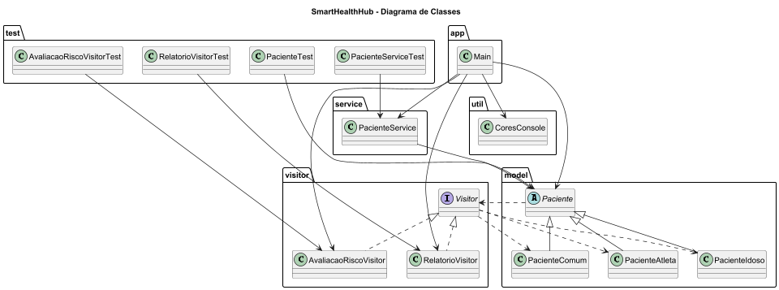

# SmartHealthHub

O projeto simula um ambiente de gerenciamento de pacientes, permitindo aplicar diferentes operações sobre os tipos de pacientes sem modificar suas classes, utilizando os conceitos de orientação a objetos e o padrão Visitor.

---

# Padrão de Projeto Utilizado

## Visitor

O padrão comportamental Visitor foi utilizado para separar operações das estruturas de objetos, permitindo adicionar novos comportamentos ao sistema sem alterar as classes existentes.

### Estrutura do padrão no projeto

| Papel | Classe |
|---|---|
| Element | Paciente |
| Concrete Elements | PacienteComum, PacienteAtleta, PacienteIdoso |
| Visitor | Visitor |
| Concrete Visitors | RelatorioVisitor, AvaliacaoRiscoVisitor |

---

# Diagrama de Classes



---

# Funcionalidades

- Cadastro de pacientes
- Pacientes comuns
- Pacientes atletas
- Pacientes idosos
- Aplicação de visitors
- Geração de relatórios
- Avaliação de risco
- Interface via console
- Organização orientada a objetos

---

# Estrutura do Projeto

```text
SmartHealthHub/
│
├── src/
│   ├── main/
│   │   ├── app/
│   │   │   └── Main.java
│   │   │
│   │   ├── model/
│   │   │   ├── Paciente.java
│   │   │   ├── PacienteComum.java
│   │   │   ├── PacienteAtleta.java
│   │   │   └── PacienteIdoso.java
│   │   │
│   │   ├── visitor/
│   │   │   ├── Visitor.java
│   │   │   ├── RelatorioVisitor.java
│   │   │   └── AvaliacaoRiscoVisitor.java
│   │   │
│   │   ├── service/
│   │   │   └── PacienteService.java
│   │   │
│   │   └── util/
│   │       └── CoresConsole.java
│   │
│   └── test/
│       ├── PacienteTest.java
│       ├── RelatorioVisitorTest.java
│       ├── AvaliacaoRiscoVisitorTest.java
│       └── PacienteServiceTest.java
│
├── docs/
│   ├── diagrama-classe.puml
│   └── diagrama-classe.png
│
├── README.md
│
└── .gitignore
```

---

# Tecnologias Utilizadas

- Java 17
- IntelliJ IDEA
- JUnit 5
- PlantUML

---

# Execução do Projeto

## Executando a aplicação

Execute a classe principal:

```text
src/main/app/Main.java
```

Ou execute pelo terminal:

```bash
javac src/main/app/Main.java
java src/main/app/Main
```

---

# Execução dos Testes

Os testes automatizados estão localizados em:

```text
src/test
```

## Executando no IntelliJ

- Clique com o botão direito na pasta `test`
- Selecione:
```text
Run Tests
```

## Executando pelo terminal

```bash
mvn test
```

---

# Casos de Teste Implementados

## PacienteTest

- Criação de paciente comum
- Criação de paciente atleta
- Criação de paciente idoso

## RelatorioVisitorTest

- Instanciação do visitor
- Aplicação de visitor em pacientes

## AvaliacaoRiscoVisitorTest

- Avaliação de risco em atletas
- Avaliação de risco em idosos
- Execução do visitor

## PacienteServiceTest

- Cadastro de pacientes
- Criação de pacientes
- Manipulação da lista de pacientes
- Inicialização da lista

---

# Exemplo de Funcionamento

```text
Relatório paciente comum: Carlos
Risco moderado para paciente comum

Relatório atleta: Fernanda
Baixo risco para atleta

Relatório idoso: João
Alto risco para idoso
```
